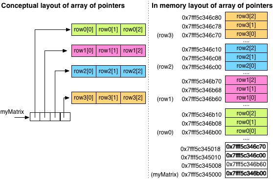

# Array of Pointers
See: [Initialise Multidimensional Array][1]

Rather than initialising as `matrix[][3]`, multidimensional data can be represented by __arrays of pointers to other arrays__:

```c
int row0[3];
int row1[3];
int row2[3];
int *matrix[4] = {row0, row1, row2};
```
Type
----
The type of `matrix` is `int **`.

Visualisation of Memory Layout
------------------------------


In this case, `matrix` is an array of 4 pointers to int, each of which points to the first element in an array of ints.

The row arrays do not need to be contiguous in memory (though they might be). The 3 entries of `matrix` hold pointers to the addresses of the three row arrays.

Array Access
------------
Array members in this case are accessed in the usual way:

```c
#include <stdio.h>

int main()
{
	int row0[] = {3, 2, 1};
	int row1[] = {3, 42, 69};
	int row2[] = {0, 1, 2};
	int *matrix[] = {row0, row1, row2};

	// Prints 42
	printf("matrix[1][1] = %d\n", matrix[1][1]);
	return 0;
}
```
Incompatibility
---------------
Multi dimensional arrays can be initialised with multiple square brackets, or as an array of pointers to arrays. __The two ways of represent multidimensional data are different and incompatible with each other__.

As different types, they cannot be implicitly converted from one to the other. If an attempt is made to cast none type to the other, undefined behviour will result.


[1]: /initialise-multidimensional-array.html
