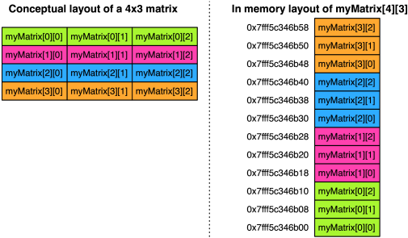

# Initialise Multi Dimensional Array
It is possible to initialise a multidimensional array using a braced initialiser, as for a one-dimensional array:

```c
int myMatrix[2][2] = {{1, 2}, {3, 4}};
```
Each element of the array is an array itself, initialised with an (enclosed) braced initialiser.

Type
----
The type of `myMatrix` is `int (*)[2]`

The compiler can determine how many elements are present from the initialiser statement, so it is legal to omit the first dimension:

```c
// Same as example above
int myMatrix[][2] = {{1, 2}, {3, 4}};
```

You can't leave out the second dimension's size specification, even when a complete initialiser is provided. This also applies to parameter declaration for functions - you can leave out the first dimension's size when declaring a function parameter, but all other dimensions of the array must have their dimensions specified.

Memory Layout
-------------


Incompatibility
---------------
Multi dimensional arrays can be initialised with multiple square brackets, or as an [array of pointers to arrays][2]. __The two ways of represent multidimensional data are different and incompatible with each other__.

As different types, they cannot be implicitly converted from one to the other. If an attempt is made to cast none type to the other, undefined behviour will result.

References
----------
* [Passing multi dimensional arrays to function][1]

[1]: https://solarianprogrammer.com/2019/03/27/c-programming-passing-multi-dimensional-array-to-function/
[2]: /array-of-pointers.html
