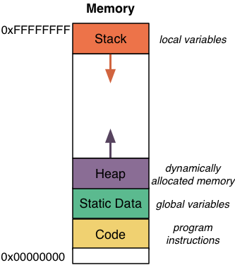

# Null
The memory allocated for a programme does not start at address 0

The space is not wasted - programmes use a pointer with the numeric value of 0 which has the special name `NULL` to mean "does not point at anything".

By not having any valid portion of the program placed at (or near) address 0, we can be sure that nothing will be placed at address 0. This means no properly initialized pointer that actually points to something would ever have the value `NULL`.

Having a special pointer does not point at anything concrete is useful:

Some algorithms need to return "there is no answer", which is not the same as saying the answer is zero.

Some functions should return `NULL` if they fail to complete their allocated tasks.

`NULL` can also be used to indicate the end of a sequence (e.g. linked lists).

`NULL` can be represented as an arrow with a flat head (indicating that it does not point at anything).

Following NULL
--------------
You can use the `NULL` pointer itself - it just has a numeric value of 0.

However, you cannot dereference the `NULL` pointer (as it does not point at anything).

If you attempt to dereference the `NULL` pointer, the programme will crash with a segmentation fault. This is an error indicating that an attempt was made to access memory in an invalid way.

Null Pointer Type
-----------------
The NULL pointer has a special type: `void *`.

A void pointer indicates a pointer to any type, and is compatible with any other pointer type.

You can assign an `int *`, a `double *`, or any other pointer type to a void pointer.

You can assign a void pointer to an `int *`, a `double *`, or any other pointer type.

Because we do not know what a `void *` actually points to, it cannot be dereferenced - the compiler has no idea what type of thing it should find at the end of the arrow. Sililarly, you cannot perform 1pointer arithmetic on a `void *`.
